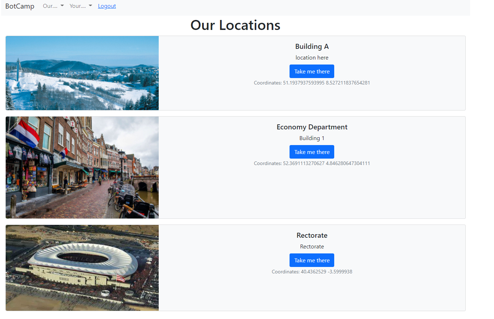

# BotCamp

## Introduction

The idea is to program a Site for a Campus where the interaction is via chat.

The user starts with a welcoming page where there is possible to interact with a chatbot that allows to have a casual chat. This chat interaction will be first filtered by a trained transformer model that will classify if the request is regarding.

I the question is related to any of the selected themes (food, locations, examination, courses, grades or sport) the necessary page will open. If not the casual chat will continue.

i.e if the user says *'I am hungry'* the application will take him to the food site where all the cafaterias, vending machines and other snack possibilities are listed.

The objective of this development was a training of a transformer model and a basic Django platform with user identification, so not all the functionality of places like food and sport are functional, but you will be pointed to their page if your question is related to food or sports. 

## Steps

### Data Generation/Augmentation

All data related to the enhancement are located in the **data_enhancement** folder.

First the data is generated for the list of questions/expressions and their class. With the list of the generated expressions they were augmented with the *Pegasus Paraphrase* model. WIth the data_enhancement.py module it is possible to enlarge our data basis. 

### Classification NLP Model Training

With the enhanced data it is time to train our transformer model. In the folder *hf_training* there is a GoogleCollab file ready to train the data provided.

The results weights of the transformer model are too heavy for GitHub and therefore can be found here: [Weights transformer](https://drive.google.com/file/d/1-A8jICe1kudQZvd98Ae4oUiUeq1opVpc/view?usp=sharing). Place it where indicated.

### Casual Chat Model

If the class detected is "greetings" the application will activate a Casual Chat Model bases in GTP2. It can be found in the folder *py_code/data*

 **Warning: All the campus data as a mockup and therefore the web for the campus is not fully functional.*

### Django App

Django is used to have the Frontend.

### User dynamic. 

1. The user can get information with or without login, when the user is logged the chat history is visible. 

   

   

   

2. The idea is that the user should login and therefore he can see the chat history and information related to him like his courses or the campus locations.

   

   
   
   

## How to use this App?

1. Download the app and the the weights.
2. Load the required modules requirements.txt in the python environment.
3. Activate the environment.
4. `python manage.py runserver`
5. https://localhost:8000

